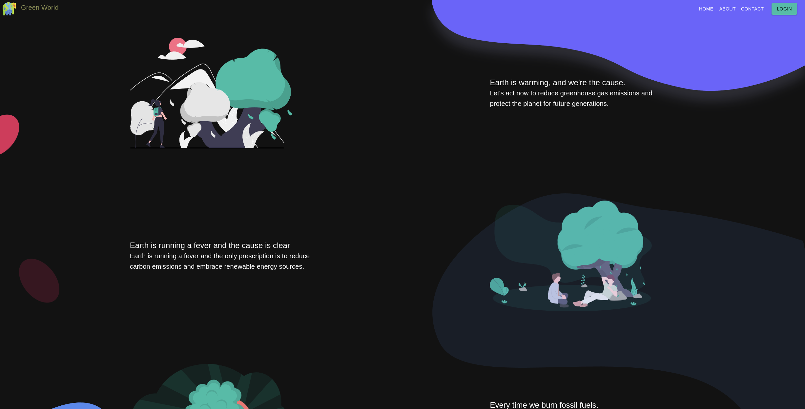
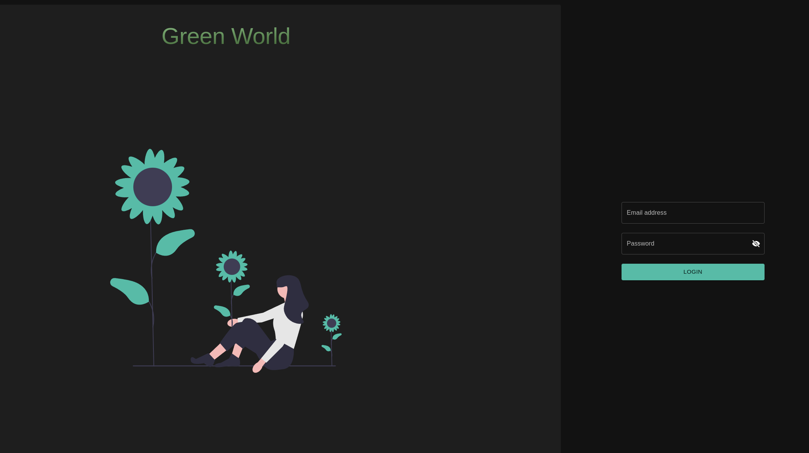
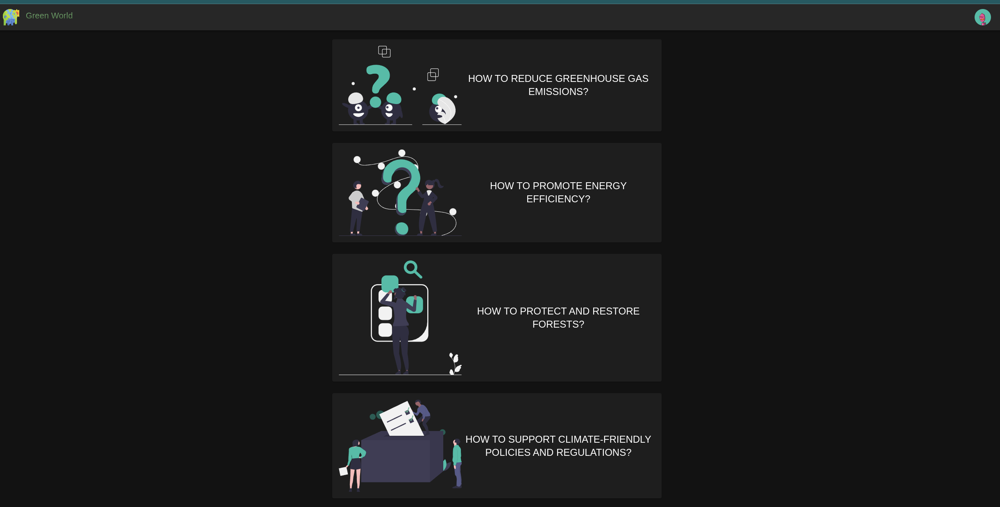

# Green World

The Green World Initiative is a global movement focused on promoting environmental sustainability and creating a
healthier planet for all living beings. The initiative aims to raise awareness about critical environmental issues, such
as climate change, deforestation, air and water pollution, and promote responsible and sustainable use of natural
resources.

## Demo Link

[https://green-world.nishtha-rajani.com/](https://green-world.nishtha-rajani.com/)

## Table of Contents

- [Green World](#green-world)
    - [Demo Link](#demo-link)
    - [Table of Contents](#table-of-contents)
    - [About the Project](#about-the-project)
        - [Built With](#built-with)
    - [Getting Started](#getting-started)
        - [Prerequisites](#prerequisites)
        - [Installation](#installation)
    - [Usage](#usage)
      - [Login Credentials](#login-credentials)
    - [Deployment](#deployment)
    - [Roadmap](#roadmap)
    - [License](#license)

## About the Project

This project is created in ReactJS, and it is a simple website for Green World Initiative. It has three parts:

**1. Landing Page**:



The landing page of Green World Initiative is designed to be simple, visually appealing and user-friendly. It has been
developed using ReactJS and incorporates a modern and responsive design to ensure seamless navigation across devices.
The landing page serves as a gateway to all the key features of the website.

**2. Login Page**:



As part of the Green World Initiative website, the Login page provides a secure and convenient way for users to access
their accounts.

The page typically includes a form that allows users to enter their login credentials, such as a username and password.
The login page call [Dummy Auth API](https://dummyjson.com/docs/auth)

**3. Dashboard Page**:



The Dashboard Page of the Green World Initiative website is the main interface for authenticated users. It provides a
comprehensive overview of the user's account and allows them to access various features of the website.
In Dashboard Page, the user can see the list of all the environment question, and it's solution.

### Built With

- [ReactJS](https://reactjs.org/)
- [React Router](https://reactrouter.com/)
- [Material UI](https://material-ui.com/)
- [React Hook Form](https://react-hook-form.com/)
- [Frame Motion](https://www.framer.com/motion/)
- [Typescript](https://www.typescriptlang.org/)
- [Zod](https://zod.dev/)
- [Axios](https://github.com/axios/axios)
- [Jest](https://jestjs.io/)
- [React Testing Library](https://testing-library.com/docs/react-testing-library/intro/)
- [EsLint](https://eslint.org/)

## Getting Started

### Prerequisites

- [NodeJS](https://nodejs.org/en/)
- [Yarn](https://yarnpkg.com/)
- [Git](https://git-scm.com/)
- [VSCode](https://code.visualstudio.com/)

### Installation

To get a local copy up and running follow these simple example steps.
- Clone the repo
  ```sh
  git clone git@github.com:nishrajani30/green-world.git
  ```
  
- Install NPM packages
  ```sh
  yarn install
  ```
  
## Usage

- Run the project
    ```sh
    yarn start
    ```

- Run the test cases

    ```sh
    yarn test
    ```

### Login Credentials

The Login page call [Dummy Auth API](https://dummyjson.com/docs/auth) to authenticate the user.
The following are the list of users with their credentials.    

| Email | Password |
| --- | --- |
| atuny0@sohu.com | 9uQFF1Lh |
| hbingley1@plala.or.jp | CQutx25i8r |
| rshawe2@51.la | OWsTbMUgFc |
| yraigatt3@nature.com | sRQxjPfdS |
| kmeus4@upenn.edu | aUTdmmmbH |
| jtreleven5@nhs.uk | zY1nE46Zm |
| dpettegre6@columbia.edu | YVmhktgYVS |
| ggude7@chron.com | MWwlaeWcOoF6 |
| nloiterton8@aol.com | HTQxxXV9Bq4 |
| umcgourty9@jalbum.net | i0xzpX |
| acharlota@liveinternet.ru | M9lbMdydMN |
| rhallawellb@dropbox.com | esTkitT1r |
| lgribbinc@posterous.com | ftGj8LZTtv9g |
| mturleyd@tumblr.com | GyLnCB8gNIp |
| kminchelle@qq.com | 0lelplR |
| dpierrof@vimeo.com | Vru55Y4tufI4 |
| vcholdcroftg@ucoz.com | mSPzYZfR |
| sberminghamh@chron.com | cAjfb8vg |
| bleveragei@so-net.ne.jp | UZGAiqPqWQHQ |
| aeatockj@psu.edu | szWAG6hc |
| ckensleyk@pen.io | tq7kPXyf |
| froachel@howstuffworks.com | rfVSKImC |
| beykelhofm@wikispaces.com | zQwaHTHbuZyr |
| brickeardn@fema.gov | bMQnPttV |
| dfundello@amazon.co.jp | k9zgV68UKw8m |
| lgronaverp@cornell.edu | 4a1dAKDv9KB9 |
| fokillq@amazon.co.jp | xZnWSWnqH |
| xisherwoodr@ask.com | HLDqN5vCF |
| jissetts@hostgator.com | ePawWgrnZR8L |
| kdulyt@umich.edu | 5t6q4KC7O |

## Deployment

The code is deployed on [AWS S3](https://aws.amazon.com/s3/) and [AWS CloudFront](https://aws.amazon.com/cloudfront/).
`deploy` folder contains the AWS CDK for the deployment.

- To deploy the code on AWS S3 and AWS CloudFront, run the following command

    ```sh
    cd deploy && cdk synth && cdk deploy
    ```

## License

Distributed under the MIT License. See `LICENSE` for more information.

## Roadmap

- [ ] Add more test cases
- [ ] Add more features
 
